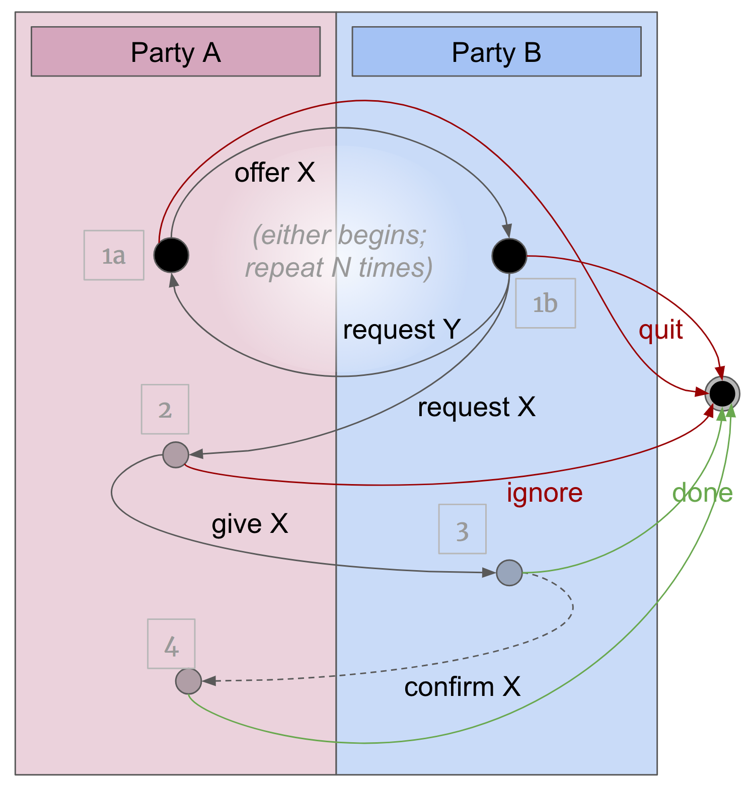

# negotiate_msg

The `negotiate_msg` flow is used whenever two parties want to interact to
arrive at a mutual agreement about delivering particular content via a
message. For example, it might be used to negotiate a credential issuance,
a proof request, or anything else where a message delivery fulfils the
purpose of the interaction. The message that fulfills the purpose of the
interaction is called the flow's __focus__.

In diagram form, `negotiate_msg` looks like this:

The interaction begins either at step 1a, with an __offer__, or at step
1b, with a __request__. The first step is an _offer_ if it is made by the
party that will eventually _send_ the focus message (A in the diagram); it
is a _request_ if it's made by the party that will _receive_ the focus message
(B in the diagram).

In either case, the other party may counter (1a goes to 1b, or vice-versa).
Proposing and counterproposing (offer X, request Y, offer A, request B...)
continues until at last a request is made that satisfies both parties
(the arrow between 1b and 2). At any point in the negotiation cycle between
1a and 1b, either party may abandon the interaction.

When agreement is reached (step 2), A may then abandon or fulfill. If
A chooses to fulfill, it sends the focus message to B. B may then conclude
the interaction, or proceed to an optional step 4 where it sends a confirmation
to A.